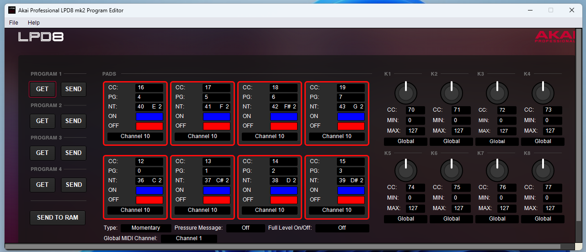
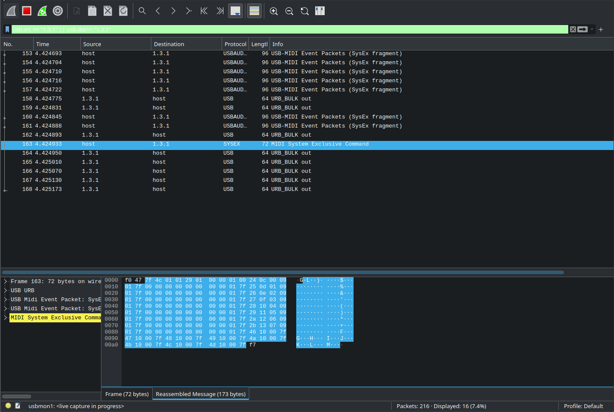
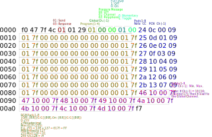

# Summary

Python tool for configuring the Akai LPD8 Mkii (Mk2) Midi controller.
Although many excellent LPD8 configuration tools exist (For example, [lpd8editor](https://github.com/charlesfleche/lpd8editor), [lpd8-web-editor](https://github.com/bennigraf/lpd8-web-editor), [lpd8](https://github.com/boomlinde/lpd8), [LPD8-Editor](https://github.com/navelpluisje/LPD8-Editor)), none could fully configure the Mkii variant.

# Methodology
I used the official Akai LPD8 Mk2 editor in a Windows virtual machine, and used Wireshark to listen to the Sysex messages it sent over USB.
For each possible input, I modified the value in the Windows tool, then examined how the Sysex message changed. 





This process resulted in a mapping of the Sysex message structure:


# Usage

```python
import lpd8mk2.config as config
import lpd8mk2.midi as midi

# Load preset 3

prog = config.Program.from_preset(3)

# View config

print(prog.config)

# Change RGB off color to white, on color to Blue for all pads

prog.set_pad_colors([255, 255, 255], [0, 0, 255])

# Change 8th pad to have an on color of red
prog.set_pad_colors(None, [255, 0, 0], [8])

# Set toggle mode and full level on
prog.config['toggle'] = True
prog.config['full_level'] = True

# Compile out the program to view the Sysex message in hex.
# Compile it to be Program 4 in the device.
print(prog(4))

# Create Sysex message for Sending through Midi (To be assigned to program 4 in the device):
sysex_message = prog.to_sysex(4)

# Send it
io.LPD8Mk2IO().send(sysex_message)

# On the device, change to program 4 if not already. If on program 4, then change to another then back to 4.

```

# JSON preset

JSON is used as the primary format for specifying a program.
The fields are defined as follows:

- `global_channel`: `int` [1-16]. Channel through which controls assigned to 'global' channel will be sent. E.g., if this is set to 14, and knob 4 is set to 'global', then knob 4 will be sent to channel 14
- `pressure_message`: `str` {off, channel, polyphonic}
- `full_level`: `bool`
- `toggle`: `bool` . If true, pads will act as toggle switches (one press, turns them on, another press turns them off), instead of momentary switches (one press turns them on, letting go turns them off).
- `pad_note`: `list[int]` [0-127]. MIDI note values corresponding to pads 1-8. E.g., `[36, 37, 38, 39, 40, 41, 42, 43]`. 
- `pad_cc`: `list[int]` [0-127]. MIDI CC values corresponding to pads 1-8. E.g., `[12, 13, 14, 15, 16, 17, 18, 19]`. 
- `pad_pcn`: `list[int]` [0-127]. MIDI Program Change values corresponding to pads 1-8. E.g., `[0, 1, 2, 3, 4, 5, 6, 7]`. 
- `pad_channel`: `list[int]` [1-17]. MIDI Channel corresponding to pads 1-8. If 17, it is set to Global channel.
- `pad_off_color`: `list[list[int]]` [0-255]. RGB Color values corresponding to pads 1-8, when *off*. E.g., `[[255, 0, 0], [255, 0, 0], [255, 0, 0], [255, 0, 0], [255, 0, 0], [255, 0, 0], [255, 0, 0], [255, 0, 0]]` defines all-red off positions.
- `pad_on_color`: `list[list[int]]` [0-255]. RGB Color values corresponding to pads 1-8, when *on*. E.g., `[[0, 0, 255], [0, 0, 255], [0, 0, 255], [0, 0, 255], [0, 0, 255], [0, 0, 255], [0, 0, 255], [0, 0, 255]]` defines all-blue on positions.
- `knob_cc`: `list[int]` [0-127]. MIDI CC values corresponding to knobs 1-8. E.g., `[70, 71, 72, 73, 74, 75, 76, 77]`
- `knob_channel`: `list[int]` [1-17]. MIDI Channel corresponding to knobs 1-8. If 17, it is set to Global channel.
- `knob_min`: `list[int]` [0-127]. Minimum MIDI values corresponding to knobs 1-8. E.g., `[0, 0, 0, 0, 0, 0, 0, 0]`
- `knob_max`: `list[int]` [0-127]. Maximum MIDI values corresponding to knobs 1-8. E.g., `[127, 127, 127, 127, 127, 127, 127, 127]`

## Included presets:
The following four presets are the four programs that, to the best of my recollection, were default an the Akai LPD8 Mkii.

### Preset 1
```json
{
    "global_channel": 1,
    "pressure_message": "off",
    "full_level": false,
    "toggle": false,
    "pad_note": [36, 37, 38, 39, 40, 41, 42, 43],
    "pad_cc": [12, 13, 14, 15, 16, 17, 18, 19],
    "pad_pcn": [0, 1, 2, 3, 4, 5, 6, 7],
    "pad_channel": [10, 10, 10, 10, 10, 10, 10, 10],
    "pad_off_color": [[255, 0, 0], [255, 0, 0], [255, 0, 0], [255, 0, 0], [255, 0, 0], [255, 0, 0], [255, 0, 0], [255, 0, 0]],
    "pad_on_color": [[0, 0, 255], [0, 0, 255], [0, 0, 255], [0, 0, 255], [0, 0, 255], [0, 0, 255], [0, 0, 255], [0, 0, 255]],
    "knob_cc": [70, 71, 72, 73, 74, 75, 76, 77],
    "knob_channel": [17, 17, 17, 17, 17, 17, 17, 17],
    "knob_min": [0, 0, 0, 0, 0, 0, 0, 0],
    "knob_max": [127, 127, 127, 127, 127, 127, 127, 127]
}
```

### Preset 2
```json
{
    "global_channel": 1,
    "pressure_message": "channel",
    "full_level": false,
    "toggle": false,
    "pad_note": [36, 37, 38, 39, 40, 41, 42, 43],
    "pad_cc": [12, 13, 14, 15, 16, 17, 18, 19],
    "pad_pcn": [0, 1, 2, 3, 4, 5, 6, 7],
    "pad_channel": [10, 10, 10, 10, 10, 10, 10, 10],
    "pad_off_color": [[0, 255, 0], [0, 255, 0], [0, 255, 0], [0, 255, 0], [0, 255, 0], [0, 255, 0], [0, 255, 0], [0, 255, 0]],
    "pad_on_color": [[255, 0, 255], [255, 0, 255], [255, 0, 255], [255, 0, 255], [255, 0, 255], [255, 0, 255], [255, 0, 255], [255, 0, 255]],
    "knob_cc": [70, 71, 72, 73, 74, 75, 76, 77],
    "knob_channel": [17, 17, 17, 17, 17, 17, 17, 17],
    "knob_min": [0, 0, 0, 0, 0, 0, 0, 0],
    "knob_max": [127, 127, 127, 127, 127, 127, 127, 127]
}
```

### Preset 3
```json
{
    "global_channel": 1,
    "pressure_message": "polyphonic",
    "full_level": false,
    "toggle": false,
    "pad_note": [36, 37, 38, 39, 40, 41, 42, 43],
    "pad_cc": [12, 13, 14, 15, 16, 17, 18, 19],
    "pad_pcn": [0, 1, 2, 3, 4, 5, 6, 7],
    "pad_channel": [10, 10, 10, 10, 10, 10, 10, 10],
    "pad_off_color": [[0, 255, 0], [0, 255, 0], [0, 255, 0], [0, 255, 0], [0, 255, 0], [0, 255, 0], [0, 255, 0], [0, 255, 0]],
    "pad_on_color": [[255, 0, 0], [255, 0, 0], [255, 0, 0], [255, 0, 0], [255, 0, 0], [255, 0, 0], [255, 0, 0], [255, 0, 0]],
    "knob_cc": [70, 71, 72, 73, 74, 75, 76, 77],
    "knob_channel": [17, 17, 17, 17, 17, 17, 17, 17],
    "knob_min": [0, 0, 0, 0, 0, 0, 0, 0],
    "knob_max": [127, 127, 127, 127, 127, 127, 127, 127]
}
```

### Preset 4
```json
{
    "global_channel": 1,
    "pressure_message": "off",
    "full_level": true,
    "toggle": true,
    "pad_note": [36, 37, 38, 39, 40, 41, 42, 43],
    "pad_cc": [12, 13, 14, 15, 16, 17, 18, 19],
    "pad_pcn": [0, 1, 2, 3, 4, 5, 6, 7],
    "pad_channel": [10, 10, 10, 10, 10, 10, 10, 10],
    "pad_off_color": [[255, 0, 255], [255, 0, 255], [255, 0, 255], [255, 0, 255], [255, 0, 255], [255, 0, 255], [255, 0, 255], [255, 0, 255]],
    "pad_on_color": [[0, 255, 0], [0, 255, 0], [0, 255, 0], [0, 255, 0], [0, 255, 0], [0, 255, 0], [0, 255, 0], [0, 255, 0]],
    "knob_cc": [70, 71, 72, 73, 74, 75, 76, 77],
    "knob_channel": [17, 17, 17, 17, 17, 17, 17, 17],
    "knob_min": [0, 0, 0, 0, 0, 0, 0, 0],
    "knob_max": [127, 127, 127, 127, 127, 127, 127, 127]
}
```
